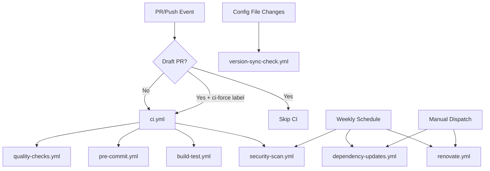

# GitHub Actions Workflows

This directory contains CI/CD workflows for the libdyson-rest project, ensuring code quality and security for all pull requests and pushes.

## Workflow Overview

### 🔍 Quality Assurance Workflows

#### `quality-checks.yml`
**Primary code quality validation**
- **Triggers**: PRs and pushes to main/develop
- **Matrix**: Python 3.9-3.13 on Ubuntu
- **Checks**: Black formatting, isort imports, Flake8 linting, mypy types, pytest tests
- **Coverage**: Uploads coverage reports to Codecov
- **Status**: ❗ Required for merge

#### `pre-commit.yml`
**Pre-commit hook validation**
- **Triggers**: PRs and pushes to main/develop
- **Environment**: Python 3.11 on Ubuntu
- **Checks**: Runs all pre-commit hooks with caching
- **Status**: ❗ Required for merge

### 🏗️ Build and Package Workflows

#### `build-test.yml`
**Cross-platform build verification**
- **Triggers**: PRs and pushes to main/develop
- **Matrix**: Python 3.9-3.13 on Ubuntu/Windows/macOS
- **Checks**: Package building, installation testing, import validation
- **Artifacts**: Uploads build artifacts from Ubuntu/Python 3.11
- **Status**: ❗ Required for merge

### 🔒 Security and Maintenance Workflows

#### `security-scan.yml`
**Security vulnerability scanning**
- **Triggers**: PRs, pushes, weekly schedule (Sundays 2 AM UTC)
- **Tools**: Safety (dependency vulnerabilities), Bandit (code security)
- **Artifacts**: Security reports with 30-day retention
- **Status**: ⚠️ Warning only (doesn't block merge)

#### `dependency-updates.yml`
**Automated dependency monitoring**
- **Triggers**: Weekly schedule (Mondays 9 AM UTC), manual dispatch
- **Checks**: Outdated packages, security audits, pre-commit updates
- **Automation**: Creates GitHub issues for available updates
- **Reports**: Dependency status artifacts

#### `renovate.yml`
**Self-hosted automated dependency management**
- **Triggers**: Weekly schedule (Mondays 6 AM UTC), manual dispatch
- **Features**: Automated PRs for dependency updates, intelligent grouping
- **Self-hosted**: No external reporting, uses standard GitHub token
- **Integration**: Automatic post-merge instructions for quality tool updates
- **Dashboard**: Creates dependency dashboard issue for centralized management

#### `version-sync-check.yml`
**Version synchronization validation**
- **Triggers**: PRs affecting configuration files
- **Purpose**: Ensures tool versions are synchronized across all config files
- **Process**: Runs `sync_versions.py` and validates no changes needed
- **Status**: ❗ Required when triggered

### 📋 Orchestration Workflows

#### `ci.yml`
**CI pipeline coordinator**
- **Triggers**: PRs and pushes to main/develop
- **Features**: Draft PR handling, automated PR comments
- **Logic**: Coordinates other workflows and provides unified status
- **Smart Skipping**: Skips CI for draft PRs (unless `ci-force` label)

## Workflow Dependencies



## Configuration Matrix

### Required Python Versions
| Workflow | Python Versions | Primary Version |
|----------|-----------------|-----------------|
| quality-checks | 3.9, 3.10, 3.11, 3.12, 3.13 | 3.11 |
| pre-commit | 3.11 | 3.11 |
| build-test | 3.9, 3.10, 3.11, 3.12, 3.13 | 3.11 |
| security-scan | 3.11 | 3.11 |
| version-sync-check | 3.11 | 3.11 |

### Operating System Support
| Workflow | Ubuntu | Windows | macOS |
|----------|--------|---------|-------|
| quality-checks | ✅ | ❌ | ❌ |
| pre-commit | ✅ | ❌ | ❌ |
| build-test | ✅ | ✅ | ✅ |
| security-scan | ✅ | ❌ | ❌ |
| version-sync-check | ✅ | ❌ | ❌ |

## Merge Requirements

### Always Required ❗
- Quality checks pass on Python 3.11
- Pre-commit hooks pass
- Build test passes on Ubuntu/Python 3.11

### Conditionally Required ❗
- Version sync check (when config files modified)

### Warning Only ⚠️
- Security scan issues
- Build failures on non-primary platforms

## Development Philosophy

This project follows a **Python-first approach**:
- All CI/CD workflows use `python -m <tool>` instead of direct executable calls
- Local development tasks (VS Code tasks.json) use `python -m <tool>` consistently
- Package is installed in development mode (`pip install -e .`) for testing
- All tools are executed through Python's module system for consistency

## Caching Strategy

### pip Dependencies
- **Key**: `${{ runner.os }}-pip-${{ hashFiles('**/requirements*.txt') }}`
- **Path**: `~/.cache/pip`
- **Benefit**: Faster dependency installation

### Pre-commit Environments
- **Key**: `pre-commit-${{ runner.os }}-${{ hashFiles('.pre-commit-config.yaml') }}`
- **Path**: `~/.cache/pre-commit`
- **Benefit**: Faster pre-commit hook execution

## Artifact Management

### Build Artifacts
- **Source**: `build-test.yml` (Ubuntu/Python 3.11 only)
- **Content**: Built wheel and source distribution
- **Retention**: 30 days
- **Use**: Release preparation, debugging build issues

### Security Reports
- **Source**: `security-scan.yml`
- **Content**: Safety and Bandit JSON reports
- **Retention**: 30 days
- **Use**: Security audit trails

### Dependency Reports
- **Source**: `dependency-updates.yml`
- **Content**: Outdated packages and audit results
- **Retention**: 30 days
- **Use**: Maintenance planning

## Troubleshooting

### Common Issues

#### Quality Checks Failing
```bash
# Run locally to debug
python -m black --check --diff .
python -m flake8 . --statistics
python -m isort --check-only --diff .
python -m mypy src/
python -m pytest
```

#### Package Import Errors in Tests
If tests fail with `ModuleNotFoundError: No module named 'libdyson_rest'`:

```bash
# Install package in development mode locally
pip install -e .

# Check the CI workflow installs the package:
# - quality-checks.yml should include "pip install -e ." after requirements installation
# - This allows pytest to import the package during testing
```

Common symptoms:
- `ImportError while loading conftest`
- `from libdyson_rest import DysonClient` fails
- Tests run locally but fail in CI

#### Windows Unicode Encoding Issues
If Windows CI fails with `UnicodeEncodeError: 'charmap' codec can't encode character`:

```bash
# Replace Unicode characters in workflow files with ASCII equivalents:
# ✓ → [OK] or PASSED
# ✗ → [ERROR] or FAILED
# ❌ → [ERROR]
# ⚠️ → [WARNING] or **IMPORTANT**

# This happens because Windows CI uses CP1252 encoding which can't display Unicode symbols
```

#### Pre-commit Failures
```bash
# Run locally to debug
pre-commit run --all-files --show-diff-on-failure
```

#### Version Sync Issues
```bash
# Check synchronization status
python scripts/sync_versions.py --dry-run --verbose

# Fix synchronization
python scripts/sync_versions.py --verbose
```

**Note**: The sync_versions.py script automatically detects:
- **Local development**: Uses `.venv/Scripts/` (Windows) or `.venv/bin/` (Unix) executables
- **CI environments**: Falls back to system-wide executables when virtual environment is not present
- **Cross-platform**: Handles Windows `.exe` extensions and Unix executable differences

#### Build Test Failures
```bash
# Test package building locally
python -m build
python -c "import glob; files = glob.glob('dist/*'); print('Built files:', files)"
python -m twine check dist/*

# Test installation
python -c "import glob; import subprocess; import sys; wheel_files = glob.glob('dist/*.whl'); subprocess.run([sys.executable, '-m', 'pip', 'install', wheel_files[0]] if wheel_files else ['echo', 'No wheel found'])"
```

### Emergency Procedures

#### Skip CI for Draft PRs
- Remove draft status, or
- Add `ci-force` label to force CI on draft

#### Override Branch Protection
- Admin access required
- Document reason in PR
- Use for critical hotfixes only

#### Manual Workflow Dispatch
- `dependency-updates.yml` supports manual triggering
- Use for immediate dependency checks

## Monitoring and Metrics

### Key Metrics
- CI success rate by branch
- Average workflow duration
- Test coverage trends
- Security vulnerability count
- Dependency freshness score

### Alerting
- Failed workflows comment on PRs with guidance
- Weekly dependency issues created automatically
- Security scan results archived for audit

### Performance Optimization
- Workflows run in parallel where possible
- Caching reduces execution time by ~60%
- Matrix builds only on required platforms
- Artifact uploads minimized to reduce transfer time
